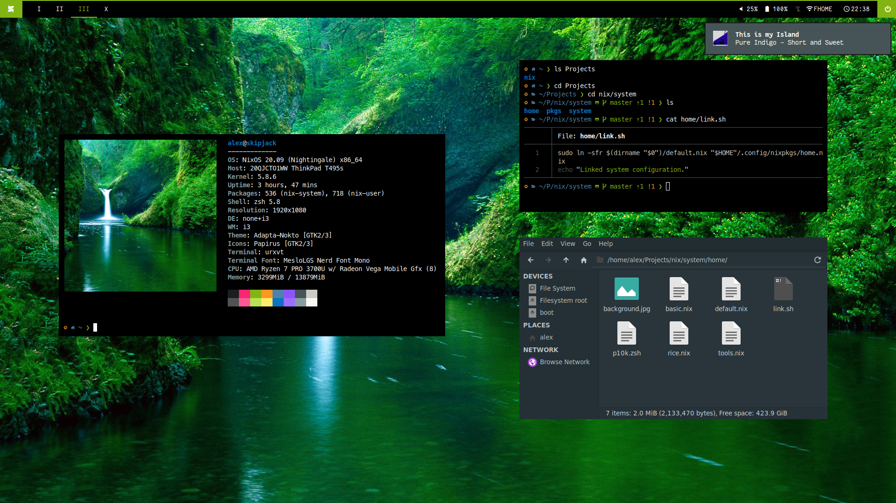

# NixOS@Skipjack



This repo contains the entirety of my operating system, my dotfiles, my applications and my custom app themes.

## What?

[Nix](https://nixos.org/) is a package manager for Linux systems. It's purely functional: It treats packages as immutable, which brings a few advantages like having the ability to install multiple versions of packages at the same time and atomic upgrades & rollbacks. All package definitions are written in a functional language called Nix.

[NixOS](https://nixos.org/) is an operating system built entirely in Nix. The complete operating system is built from a Nix project: With the advantage of all configuration being defined in a single place, distribution becomes easy. With NixOS, you also gain all the advantages of Nix: You can rollback faulty system configurations and test changes to your OS before you deploy them.

> You can read more about NixOS [here](https://nixos.org/features.html).

## Is it any good?

I've been using NixOS for the last two years and never had a problem that would have made me want to switch away. It is not beginner-friendly, though, and its ease-of-use is comparable to Arch: You really need to be comfortable with the Nix language & source code. I'd recommend it to anyone who's an advanced Linux user and is comfortable with tinkering with their system instead of getting a working behemoth of a system right out of the box.

If you're working with Docker, NixOS might sound similar to you, and in a way, it is, but instead of deploying application configurations, you deploy operating system configurations. You're working in DevOps? Need to completely synchronize all configuration and behaviour across multiple systems? Need a 100% reproducible OS for your academics subject? Don't hesitate to give NixOS a try.

## Installation

> Caution: Some configuration in `home/` and `system/`, like hardware & boot, is hardcoded to only work with my machines. Before deployment, change these values to your respective hardware settings.

### Dependencies

You'll need:
* A working [NixOS](https://nixos.org) system to deploy the NixOS configuration available in `system/`.
* [Home-Manager](https://github.com/nix-community/home-manager) to deploy the dotfiles & user settings available in `home/`.
* [NUR](https://github.com/nix-community/NUR) installed as a channel.
* This repository.

### Linking

Backup your `/etc/nixos/configuration.nix` and `~/.config/nixpkgs/home.nix` files & navigate to the the root folder of the repository.

Run `./home/link.sh` to symlink the home configuration.
```
./home/link.sh
```

Run `./system/link.sh` to symlink the system configuration.
```
./system/link.sh
```

### ... And done!

After changing your configuration in `home/`, call `home-manager switch` to rebuild your user configuration.

After changing your configuration in `system/`, call `sudo nixos-rebuild switch` to rebuild the system configuration.

## Pkgs

`pkgs/theme/` contains a work-in-progress implementation of a theming / [ricing](https://www.reddit.com/r/unixporn/wiki/themeing/dictionary#wiki_rice) framework for NixOS. This description will be updated at a later date.

---

## License

NixOS@Skipjack is released under the [MIT license](LICENSE.txt).